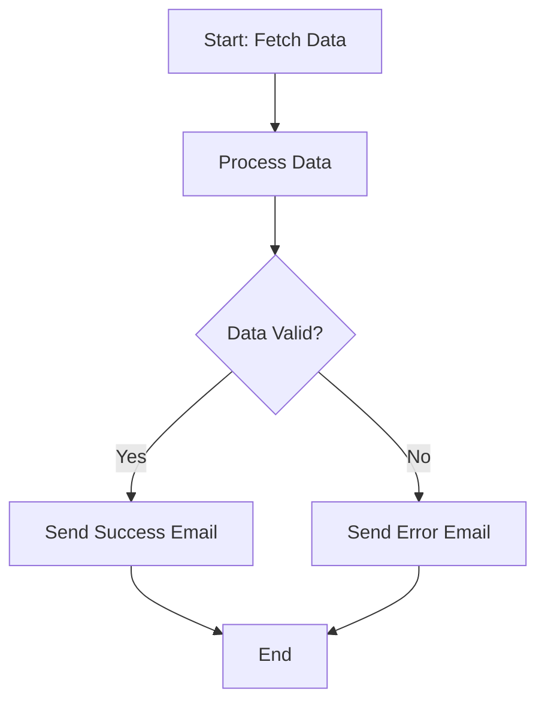

# Understanding Workflow Structure

Workflows in Supervity Agents are built from **steps** that connect together. Understanding this structure helps you create more powerful automations.

## Steps and Dependencies

### What Are Steps?

A **step** is a single action in your workflow. Examples:

- Send an email
- Read a file
- Process data
- Make an API call

### Dependencies

Steps can depend on other steps. A step with dependencies waits for its prerequisites to complete before running.

**Example:**

```
Step 1: Read file from Drive
Step 2: Process file (depends on Step 1)
Step 3: Send results via email (depends on Step 2)
```

## Parallel Execution

Steps with the same dependencies can run **in parallel** (simultaneously).

**Example:**

```
Step 1: Fetch user data
Step 2: Fetch product data (depends on Step 1)
Step 3: Fetch order data (depends on Step 1)
Step 4: Combine all data (depends on Step 2 AND Step 3)
```

In this example:

- Step 2 and Step 3 run **in parallel** after Step 1 completes
- Step 4 waits for **both** Step 2 and Step 3 to finish

## Conditional Branching

Workflows can branch based on conditions.

**Example:**

```
Step 1: Check order status
  ├─ If status = "approved" → Step 2: Send confirmation email
  └─ If status = "rejected" → Step 3: Send rejection email
```

The workflow follows different paths based on the condition result.

## Inputs and Environment Variables

### Workflow Inputs

Inputs are values you provide when running a workflow:

- **User-friendly**: Email addresses, names, dates
- **Provided at runtime**: Each execution can use different values
- **Examples**: Recipient email, search query, date range

### Environment Variables

Environment variables store sensitive or configuration data:

- **Secrets**: API keys, tokens, passwords
- **Configuration**: Service URLs, feature flags
- **Stored securely**: Not exposed in workflow definitions

## Human-in-the-Loop Steps

Some workflows need human approval or input during execution.

### Approval Steps

Pause the workflow and wait for human approval:

- Review a draft email
- Approve a document
- Confirm an action

### Input Steps

Collect additional information mid-workflow:

- Get user feedback
- Request additional details
- Collect form data

**Example:**

```
Step 1: Generate report
Step 2: [Human Input] Review and approve report
Step 3: Send approved report (depends on Step 2 approval)
```

## Visualizing Workflows

Workflows are **Directed Acyclic Graphs (DAGs)**:

- **Directed**: Steps flow in one direction
- **Acyclic**: No circular dependencies
- **Graph**: Steps connected by dependencies

### Example Workflow Diagram



## Best Practices

1. **Keep steps focused**: Each step should do one thing
2. **Use parallel execution**: Speed up workflows when possible
3. **Handle errors**: Add error handling steps
4. **Make inputs clear**: Use descriptive input names
5. **Test workflows**: Run with sample data first

## Next Steps

Ready to dive deeper? Learn about core concepts in: [Core Concepts Deep Dive](./04-core-concepts.md)
