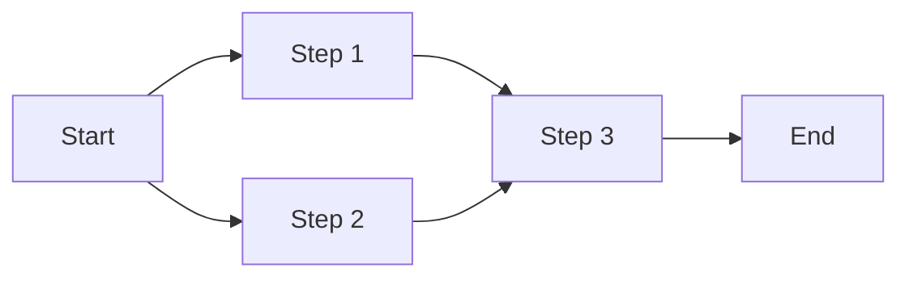

# Core Concepts Deep Dive

This tutorial covers the fundamental concepts that power Supervity Agents workflows.

## DAG (Directed Acyclic Graph)

Workflows are structured as **Directed Acyclic Graphs**:

- **Directed**: Steps flow in one direction (no going backwards)
- **Acyclic**: No circular dependencies (steps can't depend on themselves)
- **Graph**: Steps are nodes, dependencies are edges

### Why DAGs?

- **Predictable execution**: Always know what runs next
- **Parallel processing**: Independent steps run simultaneously
- **Error handling**: Clear failure points and recovery paths

### DAG Example

In this DAG:

- Step 1 and Step 2 run in parallel
- Step 3 waits for both Step 1 and Step 2
- Step 4 runs after Step 3

## Step Execution Model

### Execution Flow

1. **Identify ready steps**: Steps with all dependencies completed
2. **Execute in parallel**: All ready steps run simultaneously
3. **Mark as complete**: Update step status
4. **Check for new ready steps**: Repeat until workflow completes

### Execution States

- **Pending**: Waiting for dependencies
- **Ready**: Dependencies met, ready to run
- **Running**: Currently executing
- **Completed**: Finished successfully
- **Failed**: Encountered an error

### Automatic Retries

The platform automatically retries failed steps:

- **Configurable retry policy**: Number of attempts, backoff strategy
- **Idempotent steps**: Safe to retry without side effects
- **Error handling**: Steps can handle and recover from errors

## Integration Connections

### What Are Integrations?

Integrations connect your workflows to external services:

- **OAuth Authentication**: Secure, delegated access
- **Pre-configured Actions**: Ready-to-use operations
- **Automatic Token Management**: Handles refresh and renewal

### Available Integrations

**Communication:**

- Gmail, Outlook
- Microsoft Teams, Slack

**Storage:**

- Google Drive, OneDrive
- Dropbox, Box

**Productivity:**

- Google Sheets, Docs
- Notion

**Business:**

- Salesforce, HubSpot
- Jira

And many more!

### Using Integrations

When you mention a service in your workflow description, the agent:

1. **Identifies** the required integration
2. **Checks** if you're connected
3. **Prompts** for connection if needed
4. **Uses** the integration in workflow steps

## Scheduling Workflows

### Schedule Types

**One-time**: Run once at a specific time
**Recurring**: Run on a schedule (daily, weekly, etc.)

### Schedule Examples

- **Daily at 9 AM**: Send morning reports
- **Every Monday**: Weekly summary emails
- **First of month**: Monthly invoices
- **Every 2 hours**: Data synchronization

### Schedule Configuration

When creating a scheduled workflow:

1. **Define the schedule**: When should it run?
2. **Set timezone**: What timezone for the schedule?
3. **Configure inputs**: Default values for scheduled runs

## Workflow Lifecycle

### States

- **Draft**: Being created or edited
- **Published**: Ready to use
- **Archived**: No longer active

### Versioning

Workflows are versioned:

- **Automatic versioning**: Each save creates a new version
- **Version history**: Track changes over time
- **Rollback**: Revert to previous versions

## Advanced Features

### Workflow Composition

Workflows can call other workflows:

- **Reusable components**: Build once, use many times
- **Modular design**: Break complex workflows into parts
- **Workflow libraries**: Share workflows across teams

### Error Handling

- **Try-catch patterns**: Handle errors gracefully
- **Fallback steps**: Alternative paths on failure
- **Notification steps**: Alert on errors

### Performance Optimization

- **Parallel execution**: Maximize concurrency
- **Caching**: Store frequently used data
- **Batch processing**: Process multiple items together

## Next Steps

You now understand the core concepts! Explore the tutorial library for:

- **Basic tutorials**: Common use cases
- **Intermediate tutorials**: Multi-step workflows
- **Advanced tutorials**: Complex automations
- **Integration guides**: Service-specific tutorials
